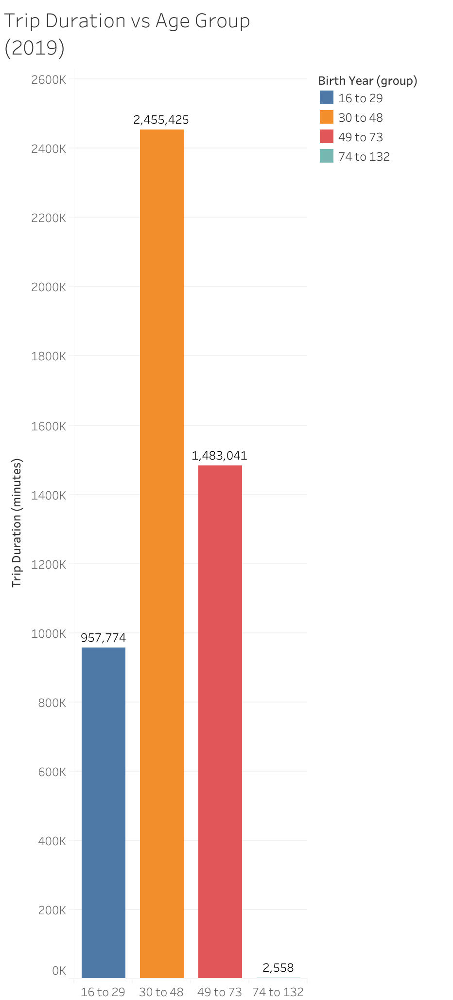
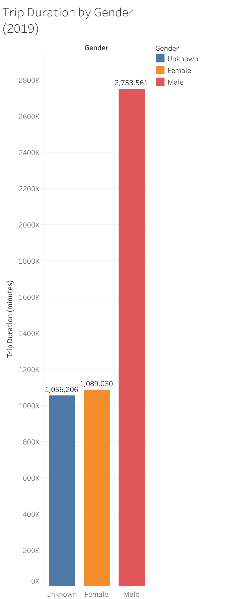
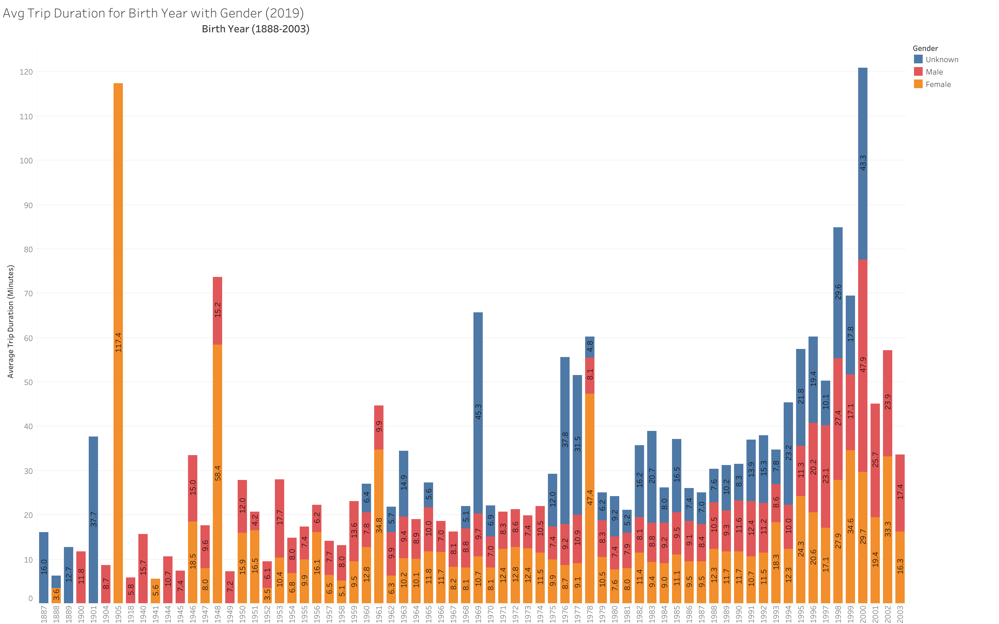

# tableau-challenge - Citi Bike Analytics

[Tableau Public Profile Project Link](https://public.tableau.com/profile/satvik.ajmera#!/vizhome/citi-bikes-challenge/CitiBikeStory?publish=yes)

# Background

Looking at the Citi Bike website [New York Citi Bike Website](https://www.citibikenyc.com/system-data), I decided to only use Citi Bike data in 2019. There were 12 csv files for each month, so I used jupyter notebook to concatenate each csv into a single csv . The data did not require any further clean-up. From there, I used Tableau to create 5 visualizations, 2 dashboards, 1 geomap dashboard and 1 story.

## Visualizations

**Visualization 1**

By default, trip duration from the start location to end location is given in seconds. However, I created a calculated measure of the trip duration in minutes. This bar graph compares the Trip Duration to the given age group. In the year 2019, the age group of 30 to 48 have the longest trip duration with over 2 million minutes traveled. The second group with the largest trip duration is from ages 49 to 73.

**Visualization 2**

Once again, I have used trip duration in minutes. This visualization shows that the largest proportion of the sum total of trip duration are males. Therefore, males are using the bikes the most to travel.

**Visualization 3**

