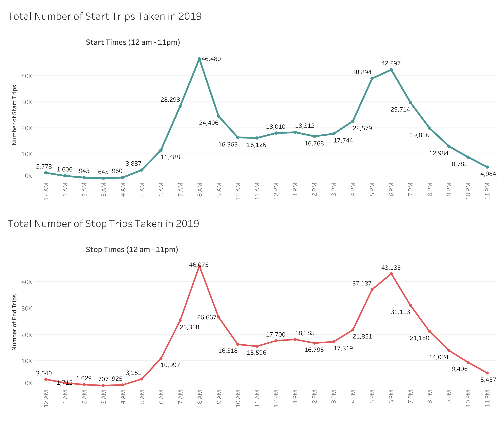
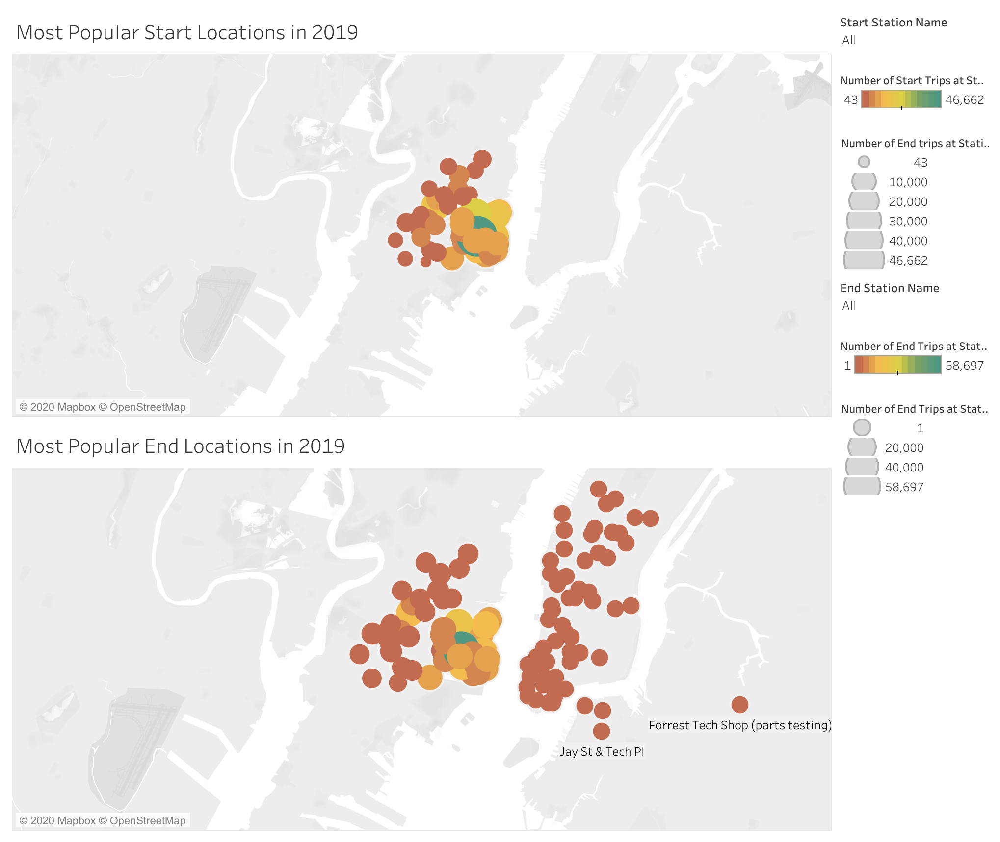

# tableau-challenge - Citi Bike Analytics

[Tableau Public Profile Project Link](https://public.tableau.com/profile/satvik.ajmera#!/vizhome/citi-bikes-challenge/CitiBikeStory?publish=yes)

# Background

Looking at the Citi Bike website [New York Citi Bike Website](https://www.citibikenyc.com/system-data), I decided to only use Citi Bike data in 2019. There were 12 csv files for each month, so I used jupyter notebook to concatenate each csv into a single csv . The data did not require any further clean-up. From there, I used Tableau to create 5 visualizations, 2 dashboards, 1 geomap dashboard and 1 story.

## Visualizations

**Visualization 1**

By default, trip duration from the start location to end location is given in seconds. However, I created a calculated measure of the trip duration in minutes. This bar graph compares the Trip Duration to the given age group. In the year 2019, the age group of 30 to 48 have the longest trip duration with over 2 million minutes traveled. The second group with the largest trip duration is from ages 49 to 73.

**Visualization 2**

Once again, I have used trip duration in minutes. This visualization shows that the largest proportion of the sum total of trip duration are males. Therefore, males are using the bikes the most to travel.

**Visualization 3**

This stacked bar graph shows the average trip duration in minutes for each age group. Additionally, I added another element to it showing average trip duration traveled with the gender included. Something I found quirky about this graph was that highest average trip traveled was females born in 1905. The females' ages are 115 years old and I believe that the group are most likely lying about their age.

**Visualization 3 and 4**

This dashboard consists of two visuals. The graphs both show the total number of start and end trips by the hour of the day. As we can see that the most active start and end times are at 8 am and 6 pm, which can be explained by normal commute hours. 

**Visualization 5 and 6**

This geomap dashboard shows the most popular start and end locations using the count of station ids. As we can see grove street is the most popular start and end location.